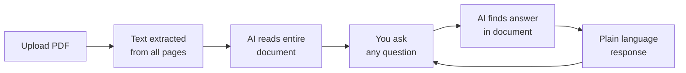

<div align="center">

# 📄 PDF Chat AI

### Talk to any PDF. Get instant answers in plain language.

[](https://pdfchat-ai.streamlit.app/)


**[🚀 Try Live App](https://pdfchat-ai.streamlit.app/)** · **[Report Bug](https://github.com/princemittalr/pdf-chat-ai/issues)** · **[Request Feature](https://github.com/princemittalr/pdf-chat-ai/issues)**

</div>

---

## 🔍 The Problem

PDFs are everywhere — and almost impossible to navigate quickly.

- Government circulars buried in 40-page documents
- College syllabi that take 20 minutes to scan
- Legal contracts nobody actually reads
- Research papers too dense to skim
- Scholarship and scheme documents in bureaucratic language

**Most people give up and miss critical information hiding in plain sight.**

---

## ✅ The Solution

Upload any PDF. Ask anything. Get a direct, plain-language answer — instantly.

No reading. No scrolling. No confusion.

> *"Which chapter has sorting algorithms?"*
> *"What is the last date mentioned in this circular?"*
> *"Am I eligible based on what this document says?"*

---

## 🌟 Features

| Feature | Description |
|---|---|
| 📤 Any PDF Upload | Works with textbooks, circulars, contracts, reports, brochures |
| 💬 Conversational AI | Ask follow-up questions naturally — it remembers context |
| 🔍 Honest Answers | If the answer isn't in the document, it says so — no hallucination |
| ⚡ Instant Processing | Multi-page PDFs processed in seconds |
| 🆓 No Login Required | Upload and start chatting immediately |
| 📱 Works on Any Device | No installation, runs in browser |

---

## 🚀 How It Works



---

## 💡 Use Cases

### 🎓 Students
- *"What topics are covered in Unit 4 of my syllabus?"*
- *"What is the minimum attendance required according to this handbook?"*
- *"Summarize Chapter 3 in simple language"*

### 🏛️ Citizens & Beneficiaries
- *"What documents do I need to apply according to this circular?"*
- *"What is the income limit mentioned in this scheme?"*
- *"What is the last date to apply?"*

### 💼 Professionals
- *"What are the penalty clauses in this contract?"*
- *"What are the key deliverables mentioned in this project report?"*
- *"List all dates and deadlines in this document"*

### 🔬 Researchers
- *"What methodology did the authors use?"*
- *"What were the key findings of this paper?"*
- *"Are there any limitations mentioned?"*

---

## 🖥️ Run Locally

```bash
# 1. Clone the repository
git clone https://github.com/princemittalr/pdf-chat-ai.git
cd pdf-chat-ai

# 2. Install dependencies
pip install -r requirements.txt

# 3. Set your Groq API key (free at console.groq.com)
export GROQ_API_KEY="your_key_here"

# 4. Run the app
streamlit run app.py
```

---

## 🛠️ Tech Stack

| Layer | Technology |
|---|---|
| Frontend | Streamlit |
| AI Model | LLaMA 3.3 70B via Groq API |
| PDF Processing | PyPDF2 |
| Language | Python 3.10+ |
| Hosting | Streamlit Cloud (Free) |

---

## 📁 Project Structure

```
pdf-chat-ai/
├── app.py              # Main Streamlit application
├── requirements.txt    # Python dependencies
└── README.md           # This file
```

---

## ⚙️ How the AI Stays Honest

The AI is instructed to:
- **Only answer from the uploaded document** — never from general knowledge
- **Say "I could not find this in the document"** when the answer isn't there
- **Never guess or hallucinate** information not present in the PDF

This makes it reliable for real-world use where accuracy matters.

---

## 🤝 Contributing

Pull requests welcome. Ideas for improvement:
- Support for scanned PDFs (OCR)
- Multi-PDF comparison
- Answer highlighting with page numbers
- Export conversation as summary

---

## 👨‍💻 Author

**Prince Mittal**
B.Tech CSE (AI/ML) · Dayananda Sagar University

[](https://linkedin.com/in/princemittalr)
[](https://github.com/princemittalr)

---

## 📄 License

MIT License — free to use, modify, and distribute.

---

<div align="center">

**Built to make information accessible to everyone — not just those who have time to read.**

⭐ Star this repo if it saved you time!

</div>
